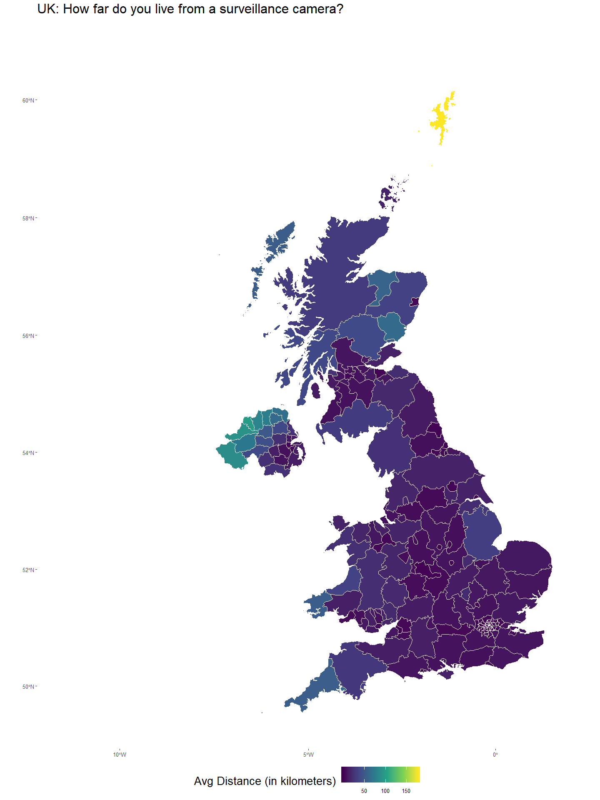

NearStats: How close do you live to a surveillance camera in the UK?
================

**NearStats**: How close do you live to a surveillance camera in the UK?
========================================================================

*Adventures in spatial analysis with R*
---------------------------------------

This process explores using R to do some basic spatial analysis on the proximity of facilities to populated places. For this application, I use LandScan Global 2016 as my population values and OpenStreetMaps points of interest data on surveillance cameras as my facilities. The process can easily be applied to other datasets.

### ***Datasets***:

-   LandScan Global 2016 (Oak Ridge National Lab): <https://landscan.ornl.gov/>
-   OpenStreetMaps Points of Interest: <http://download.geofabrik.de/>
-   UK Administrative Boundary (GADM): <https://gadm.org/data.html>

I did some preprocessing of the data in ArcGIS Pro prior to loading it into R. The steps I took are as follows: - Extract only the administrative boundaries for the UK (gadm is a global dataset) - Convert LandScan Global 2016 to points (using only pixels with pop greater than 0) and only for UK - Pull OpenStreetMaps data for the UK - combine both point and polygon Points of Interest into a single point layer - Extract all surveillance cameras from the OSM POIs for the UK (need to combine Scotland, Wales, England, Northern Ireland)

And now on to the R...

First load the necessarily libraries
------------------------------------

``` r
library(tidyverse)
```

    ## -- Attaching packages --------------------------------------------------------------------------------------- tidyverse 1.2.1 --

    ## v ggplot2 3.1.1     v purrr   0.3.2
    ## v tibble  2.1.1     v dplyr   0.8.1
    ## v tidyr   0.8.3     v stringr 1.4.0
    ## v readr   1.3.1     v forcats 0.4.0

    ## -- Conflicts ------------------------------------------------------------------------------------------ tidyverse_conflicts() --
    ## x dplyr::filter() masks stats::filter()
    ## x dplyr::lag()    masks stats::lag()

``` r
library(sf)
```

    ## Linking to GEOS 3.6.1, GDAL 2.2.3, PROJ 4.9.3

Load in the datasets
--------------------

All three datasets are shapefiles in geographic coordinates. Since we want to use distance measures in our analysis, we need to project the data. I've chosen EPSG:27700, OSGB 1936 / British National Grid -- United Kingdom Ordnance Survey. If you need to look up appropriate projections for other areas, <https://epsg.io> is a great resource.

``` r
uk_foa_prj <- st_read("datasets/uk_gadm.shp") %>%
  st_transform(crs=27700)
```

    ## Reading layer `uk_gadm' from data source `D:\Data\R\NearStats\datasets\uk_gadm.shp' using driver `ESRI Shapefile'
    ## Simple feature collection with 192 features and 60 fields
    ## geometry type:  MULTIPOLYGON
    ## dimension:      XY
    ## bbox:           xmin: -13.69139 ymin: 49.86542 xmax: 1.764168 ymax: 61.52708
    ## epsg (SRID):    4326
    ## proj4string:    +proj=longlat +datum=WGS84 +no_defs

``` r
uk_cam_prj <- st_read("datasets/uk_cams.shp") %>%
  st_transform(crs=27700)
```

    ## Reading layer `uk_cams' from data source `D:\Data\R\NearStats\datasets\uk_cams.shp' using driver `ESRI Shapefile'
    ## Simple feature collection with 4346 features and 4 fields
    ## geometry type:  POINT
    ## dimension:      XY
    ## bbox:           xmin: -6.745069 ymin: 50.05578 xmax: 1.758359 ymax: 58.98119
    ## epsg (SRID):    4326
    ## proj4string:    +proj=longlat +datum=WGS84 +no_defs

``` r
uk_ls_prj <- st_read("datasets/uk_ls_16.shp") %>%
  st_transform(crs=27700)
```

    ## Reading layer `uk_ls_16' from data source `D:\Data\R\NearStats\datasets\uk_ls_16.shp' using driver `ESRI Shapefile'
    ## Simple feature collection with 363625 features and 2 fields
    ## geometry type:  POINT
    ## dimension:      XY
    ## bbox:           xmin: -8.5875 ymin: 49.8875 xmax: 1.7625 ymax: 60.82083
    ## epsg (SRID):    4326
    ## proj4string:    +proj=longlat +datum=WGS84 +no_defs

Find out which county each population point belongs to
------------------------------------------------------

In the end, I'd like to find the average distance you're likely to live to a surveillance camera for each county in the UK. The population data doesn't come with any information about where the point falls, but the gadm data DOES come with information on the locations of the counties in the UK. In R, we can do a spatial join on these two layers to find out what county each point belongs in using `st_transform()`.

``` r
uk_ls_foa_prj <- st_join(uk_ls_prj, uk_foa_prj, join = st_intersects, left = TRUE) %>%
  select(pointid, pop = grid_code, foa = NAME_2, geometry)
```

Find the nearest camera location to each population point and calculate the distance between them
-------------------------------------------------------------------------------------------------

Right now, this process in R takes many hours to run. I'm working on different ways to accomplish this method without crashing my computer, so in the meantime, I'm running this part of the analysis in ArcGIS Pro using the `Near Tool`.

``` r
# uk_closest_cam <- list()
# for(i in seq_len(nrow(uk_ls_foa_prj))){
#   uk_closest_cam[[i]] <- uk_cam_prj[which.min(st_distance(uk_cam_prj, uk_ls_foa_prj[i,])),]
# }

# cl_cam <- data.frame(do.call(rbind.data.frame, uk_closest_cam))
# uk_ls_cam_prj <- bind_cols(uk_ls_foa_prj, cl_fac) %>%
#   select(pointid, pop, foa, geometry, cam_geom = geometry1) %>%
#   mutate(cam_dist = mapply(st_distance, geometry, cam_geom))

st_write(uk_ls_foa_prj, "uk_ls_foa_prj.shp")
```

    ## Writing layer `uk_ls_foa_prj' to data source `uk_ls_foa_prj.shp' using driver `ESRI Shapefile'
    ## features:       363625
    ## fields:         3
    ## geometry type:  Point

``` r
st_write(uk_cam_prj, "uk_cam_prj.shp")
```

    ## Writing layer `uk_cam_prj' to data source `uk_cam_prj.shp' using driver `ESRI Shapefile'
    ## features:       4346
    ## fields:         4
    ## geometry type:  Point

``` r
# In ArcGIS, use the Near Tool. Use uk_ls_foa_prj as the input features and uk_cam_prj as the near features. Check the "location" box. Then, export the file back out as "uk_ls_foa_cam_prj.shp" and prepare to reload back into R.

uk_ls_cam_prj <- st_read("datasets/uk_ls_foa_cam_prj.shp") %>% 
  select(pointid, pop, foa, cam_fid = NEAR_FID, cam_dist = NEAR_DIST, cam_x = NEAR_X, cam_y = NEAR_Y)
```

    ## Reading layer `uk_ls_foa_cam_prj' from data source `D:\Data\R\NearStats\datasets\uk_ls_foa_cam_prj.shp' using driver `ESRI Shapefile'
    ## Simple feature collection with 363625 features and 7 fields
    ## geometry type:  POINT
    ## dimension:      XY
    ## bbox:           xmin: 878.3345 ymin: 7611.435 xmax: 655588 ymax: 1215938
    ## epsg (SRID):    NA
    ## proj4string:    +proj=tmerc +lat_0=49 +lon_0=-2 +k=0.9996012717 +x_0=400000 +y_0=-100000 +ellps=airy +units=m +no_defs

Use a weighted average on the population values to find the average distance by county
--------------------------------------------------------------------------------------

``` r
uk_avg_dist <- uk_ls_cam_prj %>%
  select(foa, pop, cam_dist) %>%
  group_by(foa) %>%
  summarize(cam = weighted.mean(cam_dist, pop, forcats::fct_explicit_na(foa, na_level = "(Missing)"))/1000) %>% 
  as_tibble() %>% 
  select(foa, cam)
```

    ## Warning: Factor `foa` contains implicit NA, consider using
    ## `forcats::fct_explicit_na`

    ## Warning: Factor `foa` contains implicit NA, consider using
    ## `forcats::fct_explicit_na`

Create a quick plot of the average distance to a camera by county
-----------------------------------------------------------------

``` r
uk_foa_prj <- uk_foa_prj %>% 
  select(foa = NAME_2)
uk_foa_cam_dist_prj <- left_join(uk_foa_prj, uk_avg_dist, by = "foa")

ggplot(uk_foa_cam_dist_prj) +
  geom_sf(aes(fill = cam), color = "white") +
  scale_fill_viridis_c() +
  labs(title = "UK: How far do you live from a surveillance camera?", fill = "Avg Distance (in kilometers)") +
  theme(
    axis.text = element_text(size = 10),
    title = element_text(size = 20),
    legend.position = "bottom",
    legend.text = element_text(size = 10),
    legend.key.size = unit(1, "cm"),
    panel.background = element_blank()
  )
```


